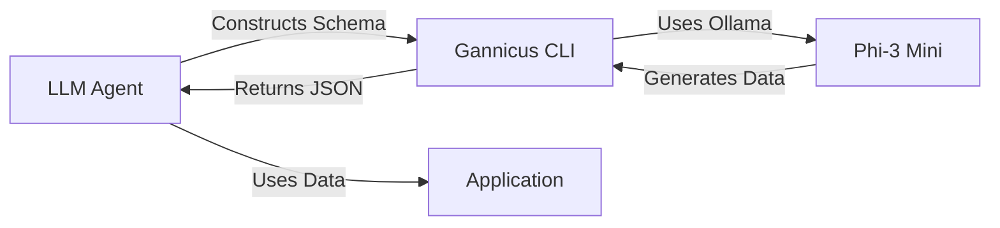

# LLM Usage Examples

## Overview

Gannicus CLI is designed to be "LLM-empowerable" - meaning LLMs like Claude Code can use it as a tool to generate synthetic data on-demand.

## Why This Matters

**Traditional workflow:**
```
LLM: "I need test data"
→ Hardcode arrays
→ Use basic random values
→ Data looks fake
```

**With Gannicus:**
```
LLM: "I need realistic user data"
→ Execute: gannicus generate --schema user --count 100 --quiet
→ Get realistic, coherent data from another LLM
→ Use it immediately
```

## Use Cases

### 1. Database Seeding in Development

```bash
# LLM generates seed data for new feature
gannicus generate --schema user --count 50 --format ndjson --quiet | \
  while read line; do
    echo "INSERT INTO users ..." # LLM constructs SQL
  done
```

### 2. Test Data Generation

```bash
# LLM needs test data for specific test case
gannicus generate --schema product --count 10 --output products.json --quiet

# Then LLM uses products.json in tests
bun test products.test.ts
```

### 3. Dynamic Schema from LLM

```typescript
// LLM constructs schema based on requirements
const schema = {
  title: { type: "llm", prompt: "A catchy blog post title" },
  author: { type: "llm", prompt: "A realistic author name" },
  views: { type: "number", min: 100, max: 10000 }
}

// Save to file
await Bun.write('blog-schema.json', JSON.stringify(schema))

// Generate
// $ gannicus generate --schema blog-schema.json --count 20 --output posts.json
```

### 4. Stdin Pipeline (Ultimate Flexibility)

```bash
# LLM constructs schema dynamically and pipes it
echo '{
  "company": {
    "type": "llm",
    "prompt": "A YC-backed startup name in the AI space"
  },
  "founded": {
    "type": "number",
    "min": 2020,
    "max": 2025
  },
  "funding": {
    "type": "enum",
    "options": ["Seed", "Series A", "Series B"]
  }
}' | gannicus generate --schema - --count 5 --quiet
```

### 5. Multi-Format Output

```bash
# JSON for programmatic use
gannicus generate --schema user --count 100 --format json --quiet > users.json

# CSV for spreadsheets
gannicus generate --schema user --count 100 --format csv --quiet > users.csv

# NDJSON for streaming/line-by-line processing
gannicus generate --schema user --count 1000 --format ndjson --quiet | \
  head -10  # LLM processes first 10
```

## CLI Flags Reference

### Required (Programmatic Mode)
- `--schema, -s` - Schema source (name, file.json, or `-` for stdin)

### Optional
- `--count, -c` - Number of records (default: 10)
- `--model, -m` - Ollama model (default: phi3:mini)
- `--output, -o` - Output file (default: stdout)
- `--format, -f` - Output format: json|ndjson|csv (default: json)
- `--quiet, -q` - Quiet mode (only output data, stats to stderr)

## Example Prompts for LLMs

**"Generate 50 realistic users for testing"**
```bash
gannicus generate --schema user --count 50 --output test-users.json --quiet
```

**"I need company data in CSV format"**
```bash
gannicus generate --schema company --count 100 --format csv --output companies.csv
```

**"Generate product data and show me the first 3"**
```bash
gannicus generate --schema product --count 100 --quiet | jq '.[0:3]'
```

## Advanced: LLM-to-LLM Data Flow



**Concrete Example:**

1. **LLM needs data**: "I'm building a blog demo, need realistic posts"
2. **LLM constructs schema**:
```json
{
  "title": { "type": "llm", "prompt": "An engaging tech blog title" },
  "excerpt": { "type": "llm", "prompt": "A 2-sentence blog excerpt", "coherence": ["title"] },
  "author": { "type": "llm", "prompt": "A tech blogger name" },
  "tags": { "type": "enum", "options": ["AI", "Web Dev", "DevOps", "Design"] }
}
```
3. **LLM executes**:
```bash
gannicus generate --schema blog.json --count 10 --quiet > posts.json
```
4. **LLM uses data**: Insert into database, use in tests, populate UI

## Why This Is Powerful

1. **No Hardcoding**: LLM doesn't need to generate fake data inline
2. **Realistic Data**: Another LLM (Phi-3/Llama/etc.) generates natural text
3. **Coherence**: Related fields stay logically consistent
4. **Scalable**: Generate 10 or 10,000 records with same command
5. **Flexible**: JSON schema allows infinite customization

## Performance Considerations

```bash
# Fast: Pre-built schemas
gannicus generate --schema user --count 100 --quiet
# ~2-3 minutes with Ollama locally

# Flexible: Custom schemas
gannicus generate --schema custom.json --count 100 --quiet
# Same performance, infinite flexibility
```

---

**This is the killer feature: An AI using an AI-powered tool to generate data it needs, on-demand, with full control.**
